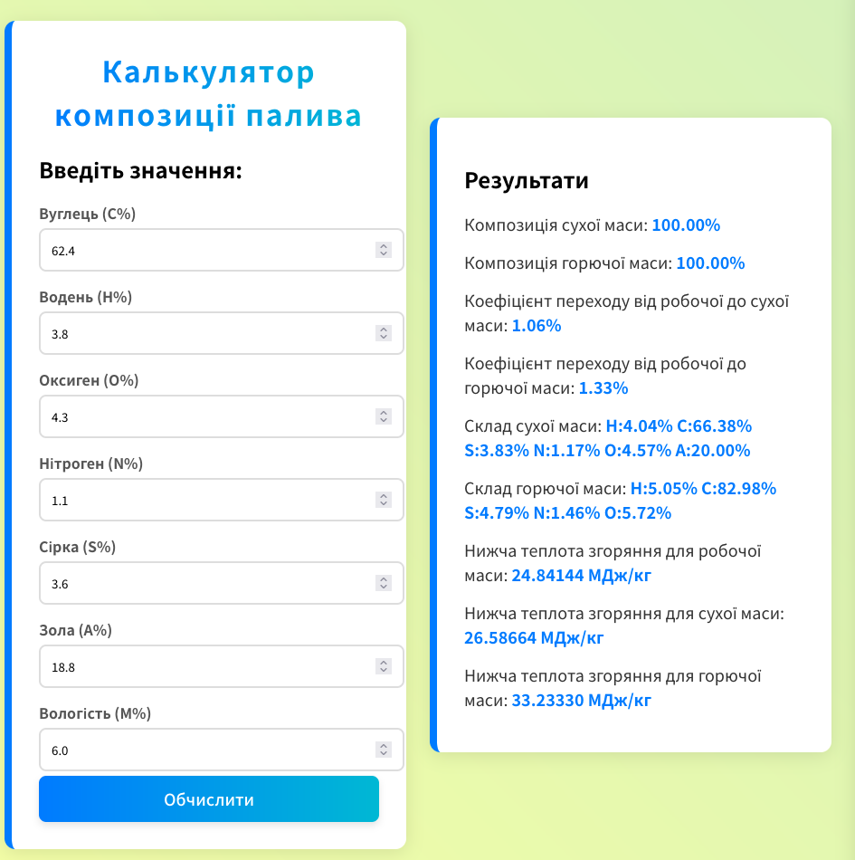
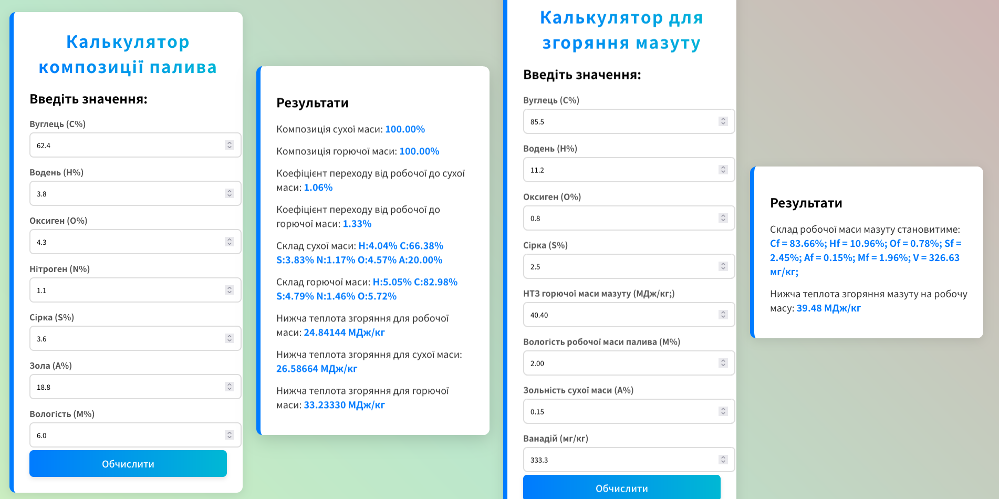

# physics-calc-1

## Опис

Написав веб-калькулятор для виконання задач по фізиці, а саме для для розрахунку складу сухої та горючої маси палива та нижчої теплоти згоряння для робочої, сухої та горючої маси за заданим складом компонентів палива

## Вигляд сайту

